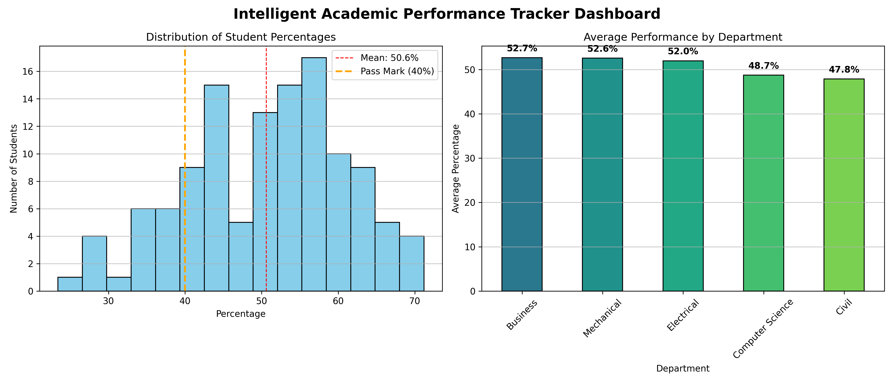

# Intelligent Academic Performance Tracker & Visualizer

## Overview
This is a College Project designed to track and visualize student academic performance. The system reads student marks from a CSV file (or generates randomized dummy data), cleans missing entries, calculates the GPA, and identifies at-risk students who score below a 40% threshold. It also generates a visual dashboard featuring grade distributions and average performance by department.

## Features
- **Data Generation**: Automatically generates a dummy student dataset (`student_marks.csv`) if none is found.
- **Data Cleaning**: Handles missing values by filling missing marks with 0.
- **GPA Calculation**: Calculates the Percentage and GPA for each student.
- **At-Risk Identification**: Filters and saves a list of at-risk students to `at_risk_students.csv`.
- **Visualization**: Generates a comprehensive Matplotlib dashboard displaying data through histograms and bar charts.

## Technologies Used
- Python 3
- Pandas
- NumPy
- Matplotlib

## Setup & Usage
1. Make sure you have the required libraries installed:
```bash
pip install pandas numpy matplotlib
```
2. Run the main processing script:
```bash
python academic_tracker.py
```

## Previews

### Dashboard
Here is the generated academic performance dashboard:


### Screenshot

